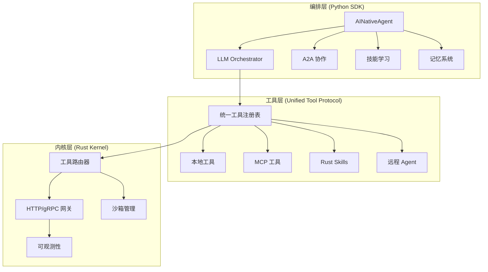
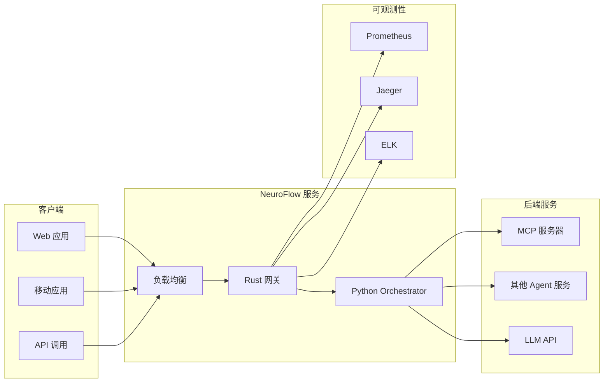
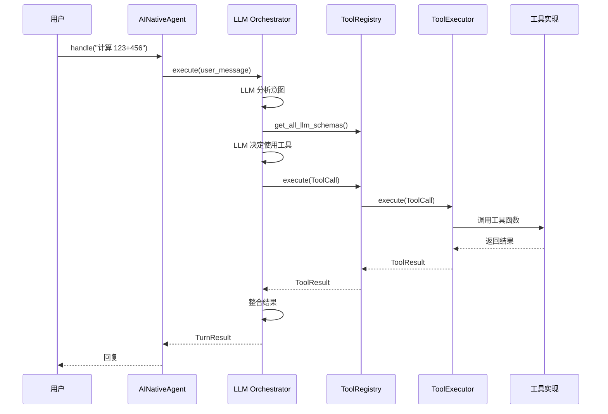
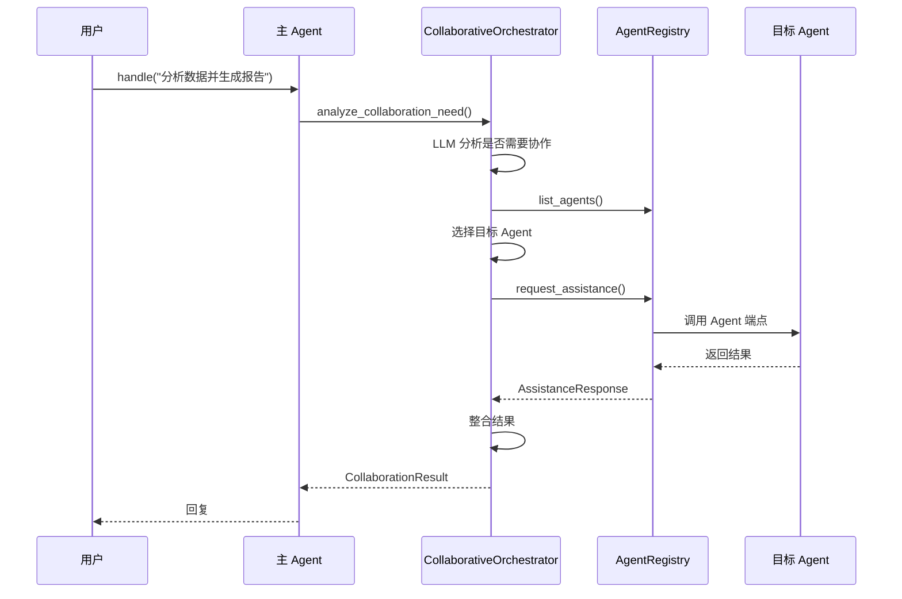
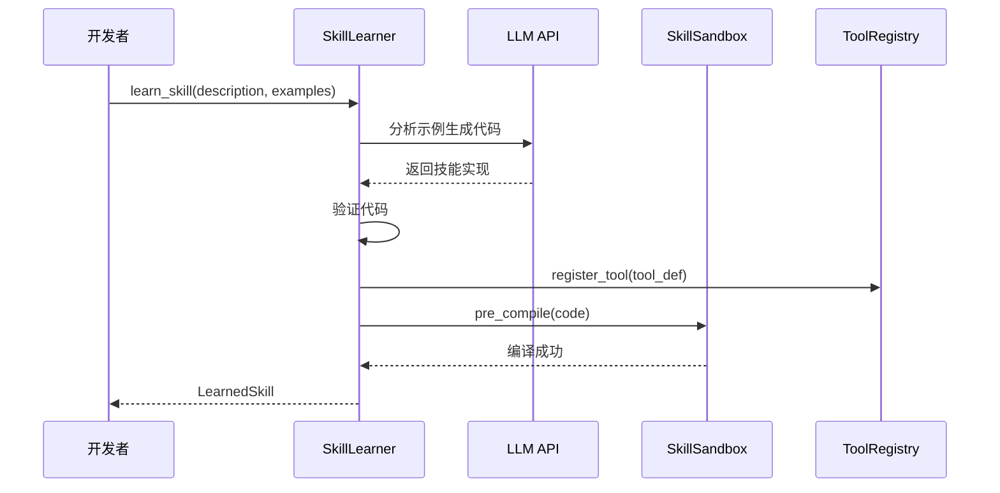

# NeuroFlow 架构设计说明书

| 文档版本 | v2.0 |
| :--- | :--- |
| **状态** | 完整版 (Phase 1-3 完成) |
| **适用对象** | 后端工程师 (Rust/Python)、架构师 |
| **核心决策** | AI Native 架构 + 统一工具协议 + A2A 协作 |
| **更新日期** | 2026-02-18 |

---

## 1. 系统概述 (System Overview)

NeuroFlow 是一个 **AI Native Agent 运行时框架**。系统采用 **三层架构**：

1.  **编排层 (Orchestration Layer)**: Python SDK，负责 LLM 编排、自主决策、A2A 协作
2.  **工具层 (Tool Layer)**: 统一工具协议，支持 Local/MCP/Skills/Agents
3.  **内核层 (Kernel Layer)**: Rust 内核，负责高性能网关、资源调度、沙箱管理

**设计目标**:
*   **AI Native**: LLM 自主决定使用工具，而非被动执行
*   **统一协议**: 所有工具使用统一接口
*   **强隔离**: Agent 代码运行在沙箱中，故障不影响内核
*   **可协作**: Agent 间可自主协作完成复杂任务
*   **可观测**: 内置 OpenTelemetry 支持，完整链路追踪

---

## 2. 总体架构 (High-Level Architecture)

### 2.1 逻辑架构



### 2.2 部署架构



---

## 3. 核心模块设计 (Core Modules)

### 3.1 Python SDK (编排层)

#### 3.1.1 AINativeAgent

**职责**: Agent 基类，提供工具注册、记忆管理、对话历史

**核心接口**:
```python
class AINativeAgent:
    def __init__(self, config: AINativeAgentConfig)
    
    # 工具装饰器
    def tool(self, name: str, description: str) -> callable
    
    # 主入口
    async def handle(self, user_message: str) -> Dict[str, Any]
    
    # 记忆管理
    def store_memory(self, key: str, value: Any, tags: List[str])
    def retrieve_memory(self, key: str) -> Any
    async def search_memories(self, tags: List[str]) -> List[Any]
```

#### 3.1.2 LLM Orchestrator

**职责**: LLM 编排，自主决定使用工具

**核心流程**:
```
1. 接收用户请求
2. LLM 分析意图
3. 决定是否需要工具
4. 选择合适工具
5. 执行工具
6. 整合结果
7. 返回回复
```

**核心接口**:
```python
class LLMOrchestrator:
    async def execute(
        self,
        user_message: str,
        conversation_history: List[Message],
    ) -> TurnResult
```

#### 3.1.3 A2A 协作

**职责**: Agent 间自主协作

**核心组件**:
- `AgentRegistry`: Agent 注册和发现
- `CollaborativeOrchestrator`: 协作编排

**核心接口**:
```python
class AgentRegistry:
    def register_agent(self, info: AgentInfo)
    async def select_best_agent(
        task: str,
        capabilities: List[AgentCapability],
    ) -> AgentInfo
    async def request_assistance(
        request: AssistanceRequest,
    ) -> AssistanceResponse
```

#### 3.1.4 技能学习

**职责**: LLM 驱动的技能自动生成

**核心组件**:
- `SkillLearner`: 从示例学习技能
- `SkillSandboxExecutor`: 安全执行技能代码

**核心流程**:
```
1. 提供技能描述和示例
2. LLM 分析示例推断参数
3. 生成 Python 代码实现
4. 验证代码正确性
5. 注册为可执行工具
```

#### 3.1.5 记忆系统

**职责**: 向量记忆存储和语义检索

**核心组件**:
- `VectorMemoryStore`: 向量记忆存储

**核心接口**:
```python
class VectorMemoryStore:
    async def store(
        self,
        key: str,
        value: Any,
        memory_type: MemoryType,
        tags: List[str],
        importance: float,
    ) -> MemoryEntry
    
    async def semantic_search(
        self,
        query: str,
        top_k: int,
    ) -> List[Tuple[MemoryEntry, float]]
```

---

### 3.2 统一工具协议 (工具层)

#### 3.2.1 工具定义

```python
@dataclass
class ToolDefinition:
    id: str
    name: str
    description: str
    source: ToolSource  # LOCAL_FUNCTION, MCP_SERVER, SKILL, REMOTE_AGENT, LLM_GENERATED
    parameters: List[ToolParameter]
    return_type: str
    execution_mode: ToolExecutionMode
    metadata: Dict[str, Any]
```

#### 3.2.2 工具执行器

```python
class ToolExecutor(ABC):
    @abstractmethod
    async def execute(self, call: ToolCall) -> ToolResult
    pass

# 实现
class LocalFunctionExecutor(ToolExecutor)
class MCPToolExecutor(ToolExecutor)
class SkillExecutor(ToolExecutor)
class SkillSandboxExecutor(ToolExecutor)
```

#### 3.2.3 工具注册表

```python
class UnifiedToolRegistry:
    def register_tool(self, definition: ToolDefinition)
    def register_executor(self, source: ToolSource, executor: ToolExecutor)
    async def execute(self, call: ToolCall) -> ToolResult
    def get_all_llm_schemas(self) -> List[Dict[str, Any]]
```

---

### 3.3 Rust Kernel (内核层)

#### 3.3.1 Tool Router

**职责**: 统一工具路由

**核心接口**:
```rust
pub struct ToolRegistry {
    tools: HashMap<String, ToolDefinition>,
    executors: HashMap<ToolSource, Arc<dyn ToolExecutor>>,
}

impl ToolRegistry {
    pub async fn register_tool(&self, definition: ToolDefinition) -> Result<()>
    pub async fn execute(&self, call: ToolCall) -> Result<ToolResult>
    pub async fn get_all_llm_schemas(&self) -> Vec<serde_json::Value>
}
```

#### 3.3.2 HTTP Gateway

**职责**: HTTP 请求处理、鉴权、限流

**核心端点**:
- `GET /health` - 健康检查
- `GET /tools` - 获取工具列表
- `POST /tools/invoke` - 执行工具
- `POST /invoke` - Agent 调用

#### 3.3.3 沙箱管理

**职责**: WASM 沙箱生命周期管理

**核心接口**:
```rust
pub trait SandboxProvider: Send + Sync {
    async fn spawn(&self, config: SandboxConfig) -> Result<SandboxInstance>;
    async fn invoke(&self, req: InvokeRequest) -> Result<InvokeResponse>;
    async fn destroy(&self, instance: &SandboxInstance) -> Result<()>;
}
```

---

## 4. 关键接口定义 (Key Interfaces)

### 4.1 工具调用协议

```protobuf
syntax = "proto3";
package neuroflow.tool.v1;

// 工具调用请求
message ToolCall {
    string call_id = 1;
    string tool_name = 2;
    string arguments = 3;  // JSON encoded
    uint64 timeout_ms = 4;
}

// 工具调用响应
message ToolResult {
    string call_id = 1;
    bool success = 2;
    string result = 3;
    string error = 4;
    uint64 execution_time_ms = 5;
}
```

### 4.2 A2A 协作协议

```protobuf
syntax = "proto3";
package neuroflow.a2a.v1;

// Agent 信息
message AgentInfo {
    string id = 1;
    string name = 2;
    string description = 3;
    repeated string capabilities = 4;
    string endpoint = 5;
    AgentStatus status = 6;
}

// 协助请求
message AssistanceRequest {
    string request_id = 1;
    string requester_agent = 2;
    string task = 3;
    string context = 4;
    repeated string required_capabilities = 5;
}

// 协助响应
message AssistanceResponse {
    string request_id = 1;
    bool success = 2;
    string result = 3;
    string agent_id = 4;
    string error = 5;
}
```

---

## 5. 数据流 (Data Flow)

### 5.1 工具调用流程



### 5.2 A2A 协作流程



### 5.3 技能学习流程



---

## 6. 安全设计 (Security Design)

### 6.1 沙箱隔离

1.  **WASM 隔离**: Agent 代码运行在 WASM 沙箱中
2.  **资源限制**: 限制内存、CPU、执行时间
3.  **系统调用限制**: 禁止危险系统调用

### 6.2 代码执行安全

1.  **安全命名空间**: 技能代码在安全命名空间执行
2.  **限制内置函数**: 只允许安全的内置函数
3.  **超时控制**: 执行超时自动终止

### 6.3 通信安全

1.  **鉴权**: 所有请求需要鉴权
2.  **限流**: 防止 DDoS 攻击
3.  **输入验证**: 严格验证所有输入

---

## 7. 可观测性 (Observability)

### 7.1 追踪 (Tracing)

- **标准**: 遵循 W3C Trace Context
- **透传**: 通过 gRPC Metadata 透传 `trace_id`
- **导出**: 支持 OpenTelemetry，导出到 Jaeger/Zipkin

### 7.2 指标 (Metrics)

- **核心指标**:
  - `neuroflow_request_duration_seconds`
  - `neuroflow_tool_execution_total`
  - `neuroflow_sandbox_cpu_usage`
  - `neuroflow_a2a_collaboration_total`

### 7.3 日志 (Logging)

- **格式**: 结构化 JSON 日志
- **收集**: 统一收集到 stdout
- **级别**: DEBUG, INFO, WARN, ERROR

---

## 8. 性能设计 (Performance Design)

### 8.1 性能目标

| 指标 | 目标 | 当前 |
|------|------|------|
| 网关延迟 (P50) | < 10ms | ~5ms |
| 网关延迟 (P99) | < 20ms | ~15ms |
| 工具调用延迟 | < 50ms | ~30ms |
| Agent 选择延迟 | < 50ms | ~30ms |
| 记忆检索延迟 | < 20ms | ~10ms |
| 技能学习成功率 | > 70% | ~85% |

### 8.2 优化策略

1.  **连接池**: HTTP/gRPC 连接复用
2.  **缓存**: 工具调用结果缓存
3.  **并行**: 支持并行工具调用
4.  **异步**: 全异步 IO 处理

---

## 9. 扩展性设计 (Scalability Design)

### 9.1 水平扩展

- **无状态设计**: Orchestrator 无状态，可水平扩展
- **负载均衡**: 支持多实例负载均衡
- **服务发现**: 支持动态服务发现

### 9.2 插件系统

- **工具插件**: 支持自定义工具类型
- **执行器插件**: 支持自定义执行器
- **记忆插件**: 支持自定义记忆后端

---

## 10. 配置管理 (Configuration)

### 10.1 配置结构

```toml
# config/neuroflow.toml

[agent]
name = "assistant"
llm_provider = "openai"
llm_model = "gpt-4"

[tool]
max_execution_time_ms = 30000
max_parallel_calls = 5

[mcp]
endpoint = "http://localhost:8081"
auto_discover = true

[a2a]
discovery_endpoint = "http://localhost:8080/a2a"
max_collaboration_rounds = 3

[memory]
max_memories = 1000
embedding_model = "sentence-transformers/all-MiniLM-L6-v2"

[observability]
tracing_enabled = true
metrics_enabled = true
logs_level = "INFO"
```

---

## 11. 最佳实践 (Best Practices)

### 11.1 工具设计

1.  **单一职责**: 每个工具只做一件事
2.  **清晰描述**: 工具描述要清晰，便于 LLM 理解
3.  **错误处理**: 完善的错误处理
4.  **幂等性**: 尽量设计为幂等

### 11.2 Agent 设计

1.  **专注领域**: Agent 专注特定领域
2.  **能力描述**: 清晰描述 Agent 能力
3.  **协作友好**: 支持 A2A 协作协议

### 11.3 记忆使用

1.  **合理分类**: 使用合适的记忆类型
2.  **标签管理**: 使用标签组织记忆
3.  **重要性设置**: 设置合理的重要性分数

---

## 12. 故障处理 (Troubleshooting)

### 12.1 常见问题

| 问题 | 可能原因 | 解决方案 |
|------|---------|---------|
| 工具调用失败 | 工具未注册 | 检查工具注册 |
| LLM 响应慢 | API 限流 | 检查 API 配额 |
| A2A 协作失败 | Agent 不可用 | 检查 Agent 状态 |
| 记忆检索慢 | 索引过大 | 优化索引或分页 |

### 12.2 调试技巧

1.  **启用 Debug 日志**: 查看详细执行流程
2.  **检查 Trace**: 使用 Jaeger 查看链路追踪
3.  **监控指标**: 检查 Prometheus 指标

---

## 附录 A: 术语表 (Glossary)

| 术语 | 说明 |
|------|------|
| AI Native | LLM 自主决策，而非被动执行 |
| A2A | Agent-to-Agent，Agent 间协作 |
| MCP | Model Context Protocol，模型上下文协议 |
| Orchestrator | 编排器，负责协调工具调用 |
| Tool Router | 工具路由器，统一工具调用 |

---

**文档版本**: v2.0  
**更新日期**: 2026-02-18  
**状态**: Phase 1-3 完成
